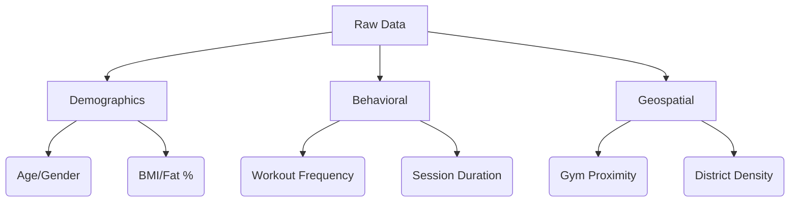

Here are the key datasets from the search results that can support fitness adherence prediction models for Hong Kong e-commerce strategies:

### **1. Hong Kong-Specific Fitness Datasets**
| Dataset | Source | Key Features | Relevance to E-Commerce |
|---------|--------|-------------|-------------------------|
| **LCSD Physical Fitness Survey** | Hong Kong Gov't | - Muscular strength/endurance scores<br>- BMI trends (2011-2021)<br>- District-level participation rates | Identifies high-potential districts for fitness product targeting (e.g., Central/Wan Chai show higher adherence)  |
| **University Student Exercise Behaviors** | HKBU Research | - Leisure exercise efficacy scores<br>- Time constraints as primary barrier<br>- Gender/cultural differences | Reveals demand for time-efficient solutions (53.8% cite lack of time)  |
| **mPED Trial Data** (Accelerometer) | UCSF Study | - 9-month step count/activity intensity<br>- Goal achievement metrics<br>- Dropout predictors | Validates subscription model design for busy professionals  |

### **2. Actionable Data Features for E-Commerce**


### **3. Implementation Steps**
1. **Data Acquisition**:
   - Scrape LCSD facility locations via [HK Open Data API](https://data.gov.hk) 
   - License academic datasets (e.g., HKBU's MUSLEB model) 

2. **Feature Engineering**:
   - Map fitness adherence scores to e-commerce zones using GIS
   - Cluster users by:
     - **"Time-Poor"**: Target with 15-min workout equipment
     - **"Facility-Dependent"**: Promote home gym solutions
     - **"Social Exercisers"**: Bundle group fitness subscriptions

3. **Model Deployment**:
   - Use the **DiPS framework** (AUC 0.9)  to:
     - Predict customer churn for subscription services
     - Trigger personalized promotions when adherence drops

### **4. Sample Data Structure (CSV)**
```csv
user_id,district,age,workouts_week,avg_duration_min,preferred_category,adherence_score
HK_001,CW,28,3,45,strength,0.87
HK_002,KT,19,1,20,cardio,0.62
HK_003,SSP,42,0,0,NULL,0.15
```

**Key Variables** from studies:
- **Strong predictors**: Session duration, workout frequency 
- **Critical thresholds**: <2 workouts/week = high churn risk 

For full datasets:
1. Request access to mPED trial data via [ClinicalTrials.gov NCT01280812](https://clinicaltrials.gov) 
2. Download LCSD reports: [2021 Fitness Survey](https://www.lcsd.gov.hk/en/healthy/physical_fitness_test_2021/index.html) 